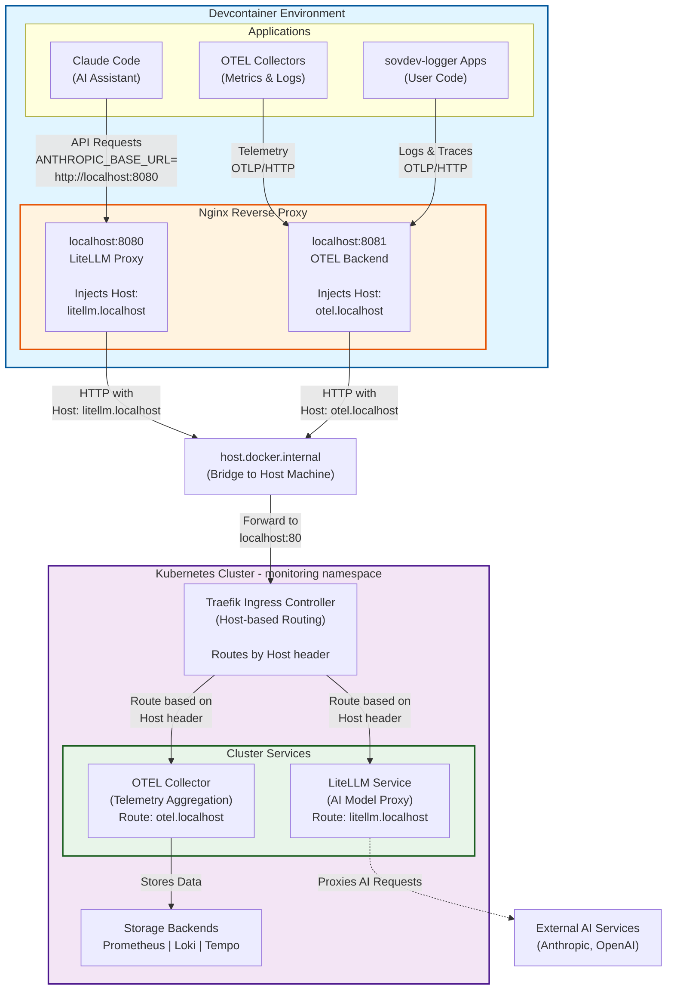

# Nginx Reverse Proxy System

This directory contains the nginx reverse proxy configuration that enables devcontainer applications to access services running in the Kubernetes cluster without requiring manual port forwarding.

## Table of Contents

- [Overview](#overview)
- [Why Nginx is Needed](#why-nginx-is-needed)
- [Architecture](#architecture)
- [Configuration Files](#configuration-files)
- [Service Endpoints](#service-endpoints)
- [How Host Header Routing Works](#how-host-header-routing-works)
- [Configuration Details](#configuration-details)
- [Troubleshooting](#troubleshooting)
- [Advanced Topics](#advanced-topics)

---

## Overview

Nginx acts as a **reverse proxy** inside the devcontainer, forwarding requests from applications to services in the Kubernetes cluster through Traefik's host-based routing.

**Key Benefits**:
- No manual `kubectl port-forward` needed
- Automatic connection to cluster services
- Transparent routing via Host headers
- Works across container rebuilds
- Supports multiple services simultaneously

---

## Why Nginx is Needed

### The Problem

Applications running in devcontainers need to send telemetry data and API requests to services in the Kubernetes cluster:

1. **OTEL Collectors** need to send metrics/logs to the cluster's OTEL backend
2. **Claude Code** needs to communicate with LiteLLM proxy for AI operations
3. **Open WebUI** needs to access the AI chat interface in the cluster
4. **sovdev-logger** applications need to send structured logs to Loki

Direct access requires:
- Manual `kubectl port-forward` commands for each service
- Port management (avoiding conflicts)
- Reconnection after port-forward disconnects
- Developer intervention

### The Solution

Nginx provides a **stable local endpoint** that:
- Listens on `localhost:8080` (LiteLLM), `localhost:8081` (OTEL), and `localhost:8082` (Open WebUI)
- Injects `Host:` headers for Traefik routing
- Forwards to `host.docker.internal` (the host machine)
- Auto-configured during container startup
- Requires no manual intervention

---

## Architecture



### Component Reference

**Devcontainer Environment:**
- **Claude Code**: AI coding assistant using LiteLLM proxy
- **OTEL Collectors**: Local collectors sending telemetry to K8s
- **sovdev-logger Apps**: User applications with structured logging
- **Nginx**: Reverse proxy with Host header injection

**Host Bridge:**
- **host.docker.internal**: Docker's special DNS name for accessing host machine

**Kubernetes Cluster:**
- **Traefik**: Ingress controller routing traffic by Host header
- **LiteLLM Service**: AI model proxy (OpenAI-compatible API)
- **OTEL Collector**: Central telemetry aggregation point
- **Storage Backends**: Prometheus (metrics), Loki (logs), Tempo (traces)

---

## Configuration Files

```
.devcontainer/additions/nginx/
├── README-nginx.md                  # This file - Architecture and usage
├── nginx.conf                       # Main nginx configuration
├── litellm-proxy.conf              # LiteLLM proxy config (active)
├── litellm-proxy.conf.template     # Template with BACKEND_URL placeholder
├── otel-proxy.conf.template        # Template with BACKEND_URL placeholder
└── openwebui-proxy.conf.template   # Template with BACKEND_URL placeholder
```

### File Purposes

**nginx.conf**
- Main nginx configuration file
- Includes proxy configurations
- Sets worker processes and connections
- Defines error logging

**litellm-proxy.conf** (Active Configuration)
- Proxies `localhost:8080` → `http://BACKEND_URL`
- Injects `Host: litellm.localhost` header
- Generated from template by `config-nginx.sh`

**litellm-proxy.conf.template** (Template)
- Contains placeholder: `{{BACKEND_URL}}`
- Replaced with actual backend during config script
- Stored for reference and regeneration

**otel-proxy.conf.template** (Template)
- Contains placeholder: `{{BACKEND_URL}}`
- Proxies `localhost:8081` → `http://BACKEND_URL`
- Injects `Host: otel.localhost` header
- Generated as `otel-proxy.conf` (gitignored)

---

## Service Endpoints

### Port 8080 - LiteLLM Proxy

**Purpose**: AI model API proxy (OpenAI-compatible)

**Used By**:
- Claude Code (via `ANTHROPIC_BASE_URL=http://localhost:8080`)
- AI coding assistants
- Applications using OpenAI SDK

**Routing**:
```
localhost:8080 → host.docker.internal → Traefik → LiteLLM Service
```

**Host Header**: `litellm.localhost`

**Example Usage**:
```bash
# Claude Code environment variable
export ANTHROPIC_BASE_URL="http://localhost:8080"
export ANTHROPIC_AUTH_TOKEN="sk-your-litellm-key"

# Test connection
curl -H "Authorization: Bearer $ANTHROPIC_AUTH_TOKEN" http://localhost:8080/health
```

### Port 8081 - OTEL Backend

**Purpose**: OpenTelemetry collector endpoint

**Used By**:
- OTEL Lifecycle Collector (devcontainer lifecycle events)
- OTEL Metrics Collector (system/container metrics)
- sovdev-logger applications (logs and traces)

**Routing**:
```
localhost:8081 → host.docker.internal → Traefik → OTEL Collector
```

**Host Header**: `otel.localhost`

**Example Usage**:
```bash
# OTEL exporter configuration
export OTEL_EXPORTER_OTLP_ENDPOINT="http://localhost:8081"

# Test connection
curl http://localhost:8081/health
```

### Port 8082 - Open WebUI

**Purpose**: AI chat interface with web UI

**Used By**:
- Open WebUI web interface
- Users accessing chat interface in browser
- Applications using Open WebUI API

**Routing**:
```
localhost:8082 → host.docker.internal → Traefik → Open WebUI Service
```

**Host Header**: `openwebui.localhost`

**Example Usage**:
```bash
# Access Open WebUI in browser
open http://localhost:8082

# Test connection
curl http://localhost:8082/health

# API usage
curl http://localhost:8082/api/v1/chats
```

**Special Features**:
- WebSocket support for real-time chat
- Extended timeouts (300s) for long AI responses
- Connection upgrade headers for WebSocket

---

## How Host Header Routing Works

### The Routing Flow

1. **Application sends request** to `localhost:8080` or `localhost:8081`
2. **Nginx receives request** and injects appropriate Host header
3. **Request forwarded** to `host.docker.internal` (host machine)
4. **Traefik receives request** on host's `localhost:80`
5. **Traefik reads Host header** and routes to correct service
6. **Response returned** through the same path

### Why Host Headers?

Traefik uses **host-based routing** to multiplex multiple services through a single port (80):

```yaml
# Traefik IngressRoute example
apiVersion: traefik.io/v1alpha1
kind: IngressRoute
metadata:
  name: litellm
spec:
  routes:
    - match: Host(`litellm.localhost`)
      kind: Rule
      services:
        - name: litellm
          port: 8080
```

Without the Host header, Traefik wouldn't know which service to route to.

### Nginx Configuration

```nginx
# LiteLLM Proxy (port 8080)
server {
    listen 8080;
    server_name localhost;

    location / {
        proxy_pass http://host.docker.internal;
        proxy_set_header Host litellm.localhost;  # Traefik routing key
        proxy_set_header X-Real-IP $remote_addr;
        proxy_set_header X-Forwarded-For $proxy_add_x_forwarded_for;
    }
}

# OTEL Proxy (port 8081)
server {
    listen 8081;
    server_name localhost;

    location / {
        proxy_pass http://host.docker.internal;
        proxy_set_header Host otel.localhost;  # Traefik routing key
        proxy_set_header X-Real-IP $remote_addr;
        proxy_set_header X-Forwarded-For $proxy_add_x_forwarded_for;
    }
}
```

---

## Configuration Details

### Backend URL Configuration

The backend URL (typically `host.docker.internal`) is configured via the `config-nginx.sh` script.

**Configuration Script**: `.devcontainer/additions/config-nginx.sh`

**Usage**:
```bash
# Interactive configuration
bash .devcontainer/additions/config-nginx.sh

# Non-interactive verification (container startup)
bash .devcontainer/additions/config-nginx.sh --verify
```

**What it does**:
1. Prompts for backend URL (default: `host.docker.internal`)
2. Generates proxy configs from templates
3. Saves configuration to `/workspace/.devcontainer.secrets/env-vars/.nginx-backend-url`
4. Creates symlink to home directory
5. Starts nginx with new configuration

**Persistence**:
- Configuration stored in `/workspace/.devcontainer.secrets/` (persists across rebuilds)
- Automatically restored on container startup via `--verify` flag

### Automatic Startup

Nginx is automatically configured and started during container creation:

**Process**:
1. `project-installs.sh` runs `restore_all_configurations()`
2. Calls `config-nginx.sh --verify` (silent mode)
3. Restores backend URL from .devcontainer.secrets if exists
4. Generates proxy configurations
5. `install-srv-nginx.sh` auto-installs nginx if needed
6. `start-nginx.sh` starts nginx with generated config

**Status Check**:
```bash
# Check if nginx is running
ps aux | grep nginx | grep -v grep

# Check listening ports
ss -tunlp | grep nginx

# Expected output:
# tcp LISTEN 0.0.0.0:8080 (nginx)
# tcp LISTEN 0.0.0.0:8081 (nginx)
```

---

## Troubleshooting

### Nginx Not Running

**Symptom**: `curl http://localhost:8080/health` fails with connection refused

**Diagnosis**:
```bash
# Check if nginx is running
ps aux | grep nginx | grep -v grep

# Check nginx error log
tail -50 ~/.nginx/logs/error.log

# Verify ports are listening
ss -tunlp | grep -E "8080|8081"
```

**Solution**:
```bash
# Start nginx manually
bash .devcontainer/additions/start-nginx.sh

# If that fails, reconfigure
bash .devcontainer/additions/config-nginx.sh
```

### Connection to Backend Fails

**Symptom**: Nginx running but requests fail with 502 Bad Gateway

**Diagnosis**:
```bash
# Check if host.docker.internal resolves
ping -c 1 host.docker.internal

# Check if Traefik is accessible from host
curl -H "Host: litellm.localhost" http://localhost/health

# Check nginx error log for upstream errors
tail -50 ~/.nginx/logs/error.log | grep upstream
```

**Common Causes**:
1. **Traefik not running on host**: Start K8s cluster services
2. **Firewall blocking**: Allow connections from Docker containers
3. **Wrong backend URL**: Reconfigure with `config-nginx.sh`
4. **Service not available**: Check K8s service status

**Solution**:
```bash
# Test backend connectivity directly
curl -H "Host: litellm.localhost" http://host.docker.internal

# Check K8s services
kubectl get svc -n monitoring litellm
kubectl get svc -n monitoring otel-collector

# Verify Traefik routes
kubectl get ingressroute -n monitoring
```

### Host Header Not Working

**Symptom**: Traefik returns 404 or routes to wrong service

**Diagnosis**:
```bash
# Test with explicit Host header
curl -H "Host: litellm.localhost" http://localhost:8080/health

# Check nginx config has Host header injection
grep "proxy_set_header Host" ~/.nginx/conf.d/*.conf
```

**Solution**:
- Verify proxy configs have correct Host headers
- Regenerate configs: `bash .devcontainer/additions/config-nginx.sh`
- Restart nginx: `bash .devcontainer/additions/stop-nginx.sh && bash .devcontainer/additions/start-nginx.sh`

### Port Conflicts

**Symptom**: Nginx fails to start with "address already in use"

**Diagnosis**:
```bash
# Check what's using ports 8080 and 8081
lsof -i :8080
lsof -i :8081

# Or on Linux
ss -tunlp | grep -E "8080|8081"
```

**Solution**:
- Stop conflicting process
- Or modify nginx ports in configuration files
- Restart nginx

---

## Advanced Topics

### Adding New Service Proxies

To add a new service proxy (e.g., for Grafana):

**1. Create template file**:
```bash
cat > .devcontainer/additions/nginx/grafana-proxy.conf.template <<'EOF'
# Grafana Proxy Configuration
server {
    listen 3000;
    server_name localhost;

    location / {
        proxy_pass http://{{BACKEND_URL}};
        proxy_set_header Host grafana.localhost;
        proxy_set_header X-Real-IP $remote_addr;
        proxy_set_header X-Forwarded-For $proxy_add_x_forwarded_for;
    }
}
EOF
```

**2. Update config-nginx.sh**:
Add generation logic for new template (similar to existing proxies)

**3. Restart nginx**:
```bash
bash .devcontainer/additions/stop-nginx.sh
bash .devcontainer/additions/config-nginx.sh
```

### Testing Configuration

**Test Host header injection**:
```bash
# Run nginx in debug mode
nginx -t -c ~/.nginx/nginx.conf

# Monitor access log
tail -f ~/.nginx/logs/access.log

# Send test request and check headers
curl -v http://localhost:8080/health 2>&1 | grep -i host
```

**Test backend connectivity**:
```bash
# Direct backend test (bypassing nginx)
curl -H "Host: litellm.localhost" http://host.docker.internal/health

# Through nginx
curl http://localhost:8080/health

# Compare responses
```

### Performance Tuning

**For high-volume telemetry**:
```nginx
# In nginx.conf
worker_processes auto;
worker_connections 4096;

# In proxy config
proxy_buffering off;
proxy_request_buffering off;
```

### Security Considerations

**Current Setup** (Development):
- Nginx listens on `127.0.0.1` (localhost only)
- Not exposed outside container
- No authentication at nginx level (handled by backends)

**Production Considerations**:
- Add SSL/TLS termination
- Implement rate limiting
- Add authentication at proxy level
- Restrict access by IP or network

---

## Related Documentation

- **Nginx Installation**: [install-srv-nginx.sh](../install-srv-nginx.sh)
- **Nginx Configuration**: [config-nginx.sh](../config-nginx.sh)
- **Nginx Startup**: [start-nginx.sh](../start-nginx.sh) and [stop-nginx.sh](../stop-nginx.sh)
- **OTEL Monitoring**: [otel/README-otel.md](../otel/README-otel.md)
- **Claude Code Setup**: [config-ai-claudecode.sh](../config-ai-claudecode.sh)

---

## Quick Reference

**Check Status**:
```bash
# Is nginx running?
ps aux | grep nginx | grep -v grep

# What ports is it listening on?
ss -tunlp | grep nginx

# Test endpoints
curl http://localhost:8080/health    # LiteLLM
curl http://localhost:8081/health    # OTEL
curl http://localhost:8082/health    # Open WebUI
```

**Restart Services**:
```bash
bash .devcontainer/additions/stop-nginx.sh
bash .devcontainer/additions/start-nginx.sh
```

**Reconfigure**:
```bash
bash .devcontainer/additions/config-nginx.sh
```

**View Logs**:
```bash
tail -f ~/.nginx/logs/error.log
tail -f ~/.nginx/logs/access.log
```

---

**Last Updated**: 2025-11-24
**Maintained By**: Devcontainer Toolbox Team
