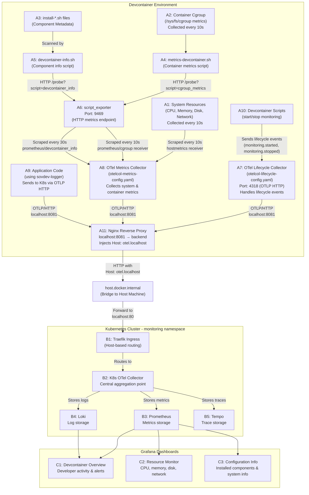

# OpenTelemetry Monitoring System

This directory contains the OpenTelemetry (OTel) monitoring infrastructure for the devcontainer environment. The system collects logs, traces, and metrics from both application code and system resources, sending them to a Kubernetes-based observability backend (Prometheus, Loki, Tempo) for visualization in Grafana.

## Table of Contents

- [Developer Onboarding](#developer-onboarding)
- [System Architecture](#system-architecture)
- [Component Overview](#component-overview)
- [Two-Collector Architecture](#two-collector-architecture)
- [Grafana Dashboards](#grafana-dashboards)
- [File Structure](#file-structure)
- [Quick Start](#quick-start)
- [Configuration](#configuration)
- [Troubleshooting](#troubleshooting)
- [Advanced Usage](#advanced-usage)

---

## Developer Onboarding

Before using the monitoring system, developers need to configure their identity. This is a two-part process involving an administrator and the developer.

### Overview

The monitoring system requires each developer to have a unique identity that tags all telemetry data. This enables multi-tenant monitoring where multiple developers can work on different projects while their activity is tracked separately in Grafana dashboards.

**Required Identity Information**:
- `DEVELOPER_ID`: Unique developer identifier (e.g., `john-doe`)
- `DEVELOPER_EMAIL`: Developer's email address
- `PROJECT_NAME`: Project identifier (e.g., `client-portal`)
- `TS_HOSTNAME`: Auto-generated hostname (format: `dev-{developer-id}-{project-name}`)

### Step 1: Administrator Generates Identity String

The administrator uses the `generate-devcontainer-identity.sh` script to create a secure, base64-encoded identity string for the developer.

**Script Location**: `/workspace/.devcontainer/additions/otel/adm/generate-devcontainer-identity.sh`

**Usage**:
```bash
bash /workspace/.devcontainer/additions/otel/adm/generate-devcontainer-identity.sh \
  <developer-id> \
  <email> \
  <project-name>
```

**Example**:
```bash
bash /workspace/.devcontainer/additions/otel/adm/generate-devcontainer-identity.sh \
  john-doe \
  john.doe@developer.com \
  client-portal
```

**Output**:
```
━━━━━━━━━━━━━━━━━━━━━━━━━━━━━━━━━━━━━━━━━━━━━━━━━━━━━━━━━━━
🔐 Generating Developer Identity
━━━━━━━━━━━━━━━━━━━━━━━━━━━━━━━━━━━━━━━━━━━━━━━━━━━━━━━━━━━

📋 Identity Configuration:
   Developer ID:    john-doe
   Email:           john.doe@developer.com
   Project:         client-portal
   Hostname:        dev-john-doe-client-portal

✅ Identity string generated!

━━━━━━━━━━━━━━━━━━━━━━━━━━━━━━━━━━━━━━━━━━━━━━━━━━━━━━━━━━━
📤 Send this to developer (via Slack, email, or 1Password):
━━━━━━━━━━━━━━━━━━━━━━━━━━━━━━━━━━━━━━━━━━━━━━━━━━━━━━━━━━━

ZXhwb3J0IERFVEVMT1BFUl9JRD0iam9obi1kb2UiCmV4cG9ydCBERVZFTE9QRVJfRU1BSUw9ImpvaG4uZG9lQGRldmVsb3Blci5jb20iCmV4cG9ydCBQUk9KRUNUX05BTUU9ImNsaWVudC1wb3J0YWwiCmV4cG9ydCBUU19IT1NUTkFNRT0iZGV2LWpvaG4tZG9lLWNsaWVudC1wb3J0YWwiCg==

━━━━━━━━━━━━━━━━━━━━━━━━━━━━━━━━━━━━━━━━━━━━━━━━━━━━━━━━━━━
```

The administrator then sends this base64 string to the developer via a secure channel (Slack DM, email, 1Password shared vault, etc.).

### Step 2: Developer Configures Identity

The developer receives the identity string and uses the `config-devcontainer-identity.sh` script to configure their devcontainer environment.

**Script Location**: `/workspace/.devcontainer/additions/config-devcontainer-identity.sh`

**Usage**:
```bash
bash /workspace/.devcontainer/additions/config-devcontainer-identity.sh
```

**Interactive Setup Process**:

1. **Paste identity string**: The script prompts for the base64 string from the administrator
2. **Review configuration**: The script decodes and displays the identity information for confirmation
3. **Install OTel Collector** (optional): If not installed, the script offers to install monitoring components
4. **Start monitoring** (optional): The script offers to start the monitoring services

**Example Session**:
```
━━━━━━━━━━━━━━━━━━━━━━━━━━━━━━━━━━━━━━━━━━━━━━━━━━━━━━━━━━━
🔐 Developer Identity Setup
━━━━━━━━━━━━━━━━━━━━━━━━━━━━━━━━━━━━━━━━━━━━━━━━━━━━━━━━━━━

This script will configure your identity for devcontainer monitoring.

━━━━━━━━━━━━━━━━━━━━━━━━━━━━━━━━━━━━━━━━━━━━━━━━━━━━━━━━━━━
📋 Enter Identity String
━━━━━━━━━━━━━━━━━━━━━━━━━━━━━━━━━━━━━━━━━━━━━━━━━━━━━━━━━━━

Paste the base64 string provided by your administrator:
(It will be a long string of letters and numbers)

ZXhwb3J0IERFVEVMT1BFUl9JRD0iam9obi1kb2UiCmV4cG9ydCBERVZFTE9QRVJfRU1BSUw9ImpvaG4uZG9lQGRldmVsb3Blci5jb20iCmV4cG9ydCBQUk9KRUNUX05BTUU9ImNsaWVudC1wb3J0YWwiCmV4cG9ydCBUU19IT1NUTkFNRT0iZGV2LWpvaG4tZG9lLWNsaWVudC1wb3J0YWwiCg==

ℹ️  Decoding identity string...
✅ Identity string decoded successfully

━━━━━━━━━━━━━━━━━━━━━━━━━━━━━━━━━━━━━━━━━━━━━━━━━━━━━━━━━━━
📝 Your Identity Configuration:
━━━━━━━━━━━━━━━━━━━━━━━━━━━━━━━━━━━━━━━━━━━━━━━━━━━━━━━━━━━

   Developer ID:    john-doe
   Email:           john.doe@developer.com
   Project:         client-portal
   Hostname:        dev-john-doe-client-portal

Does this look correct? (y/N): y

ℹ️  Writing identity configuration...
✅ Identity file created: /home/vscode/.devcontainer-identity
ℹ️  Configuring shell environment...
✅ .bashrc updated
ℹ️  Loading identity in current session...
✅ Identity loaded

━━━━━━━━━━━━━━━━━━━━━━━━━━━━━━━━━━━━━━━━━━━━━━━━━━━━━━━━━━━
📦 Install Monitoring Service?
━━━━━━━━━━━━━━━━━━━━━━━━━━━━━━━━━━━━━━━━━━━━━━━━━━━━━━━━━━━

The OpenTelemetry Collector is not installed yet.
It's required for devcontainer monitoring.

Install it now? (Y/n): y

[Installation proceeds...]

━━━━━━━━━━━━━━━━━━━━━━━━━━━━━━━━━━━━━━━━━━━━━━━━━━━━━━━━━━━
🚀 Start Monitoring Service?
━━━━━━━━━━━━━━━━━━━━━━━━━━━━━━━━━━━━━━━━━━━━━━━━━━━━━━━━━━━

Start monitoring now? (Y/n): y

✅ Monitoring services started

━━━━━━━━━━━━━━━━━━━━━━━━━━━━━━━━━━━━━━━━━━━━━━━━━━━━━━━━━━━
🎉 Setup Complete!
━━━━━━━━━━━━━━━━━━━━━━━━━━━━━━━━━━━━━━━━━━━━━━━━━━━━━━━━━━━

✅ Your identity is configured
✅ New terminals will automatically load your identity

📝 Important - Load Identity in Current Terminal:

   Run this command now:
   source ~/.devcontainer-identity

   Or open a new terminal (identity loads automatically)
```

### Identity Storage

The identity configuration is stored in `~/.devcontainer-identity` and automatically loaded in new terminal sessions via `.bashrc`.

**File Location**: `~/.devcontainer-identity`

**Contents** (plain text export statements):
```bash
export DEVELOPER_ID="john-doe"
export DEVELOPER_EMAIL="john.doe@developer.com"
export PROJECT_NAME="client-portal"
export TS_HOSTNAME="dev-john-doe-client-portal"
```

**Security Notes**:
- File permissions: `600` (readable only by user)
- Not committed to git (in `.gitignore`)
- Private to your devcontainer
- Can be regenerated if lost

### Verifying Identity Configuration

After setup, verify your identity is loaded:

```bash
# Check environment variables
echo "Developer ID: $DEVELOPER_ID"
echo "Project Name: $PROJECT_NAME"

# Expected output:
# Developer ID: john-doe
# Project Name: client-portal
```

### Reconfiguring Identity

To change your identity (e.g., switching projects), simply run the setup script again:

```bash
bash /workspace/.devcontainer/additions/config-devcontainer-identity.sh
```

The script will detect the existing configuration and ask if you want to reconfigure.

### Next Steps

After configuring your identity:

1. **Start monitoring** (if not done during setup):
   ```bash
   service-otel-monitoring.sh --start
   ```

2. **Access Grafana dashboards**: http://grafana.localhost
   - Navigate to **Dashboards** → **Devcontainer** folder
   - View your activity in the **Devcontainer Overview** dashboard

3. **Use sovdev-logger in your code**: See language-specific READMEs in `/workspace/{language}/`

---

## System Architecture

The following diagram shows how all components are connected and how telemetry data flows from the devcontainer to Grafana dashboards:



**Component Reference:**
- **A1-A11**: Devcontainer Environment components
  - A1: System Resources, A2: Container Cgroup, A3: Install Scripts
  - A4: Cgroup Script, A5: Devcontainer Info Script
  - A6: Script Exporter (port 9469), A7: Lifecycle Collector (port 4318)
  - A8: Metrics Collector, A9: Application Code (using sovdev-logger)
  - A10: Devcontainer Scripts (start/stop monitoring)
  - A11: Nginx Reverse Proxy (port 8081 - injects Host header for Traefik routing)
- **B1-B5**: Kubernetes Cluster components
  - B1: Traefik (ingress routing), B2: K8s OTel Collector, B3: Prometheus, B4: Loki, B5: Tempo
- **C1-C3**: Grafana Dashboards
  - C1: Developer Activity Dashboard, C2: Resource Monitoring Dashboard, C3: Configuration Info Dashboard

**Networking Note**: Telemetry routing uses nginx reverse proxy on localhost:8081 to forward requests to the Kubernetes cluster. The nginx proxy injects the `Host: otel.localhost` header for Traefik's host-based routing. For complete networking architecture and configuration details, see [Nginx Reverse Proxy Documentation](../nginx/README-nginx.md).

---

## Component Overview

### Devcontainer Components

#### A6: Script Exporter (ricoberger/script_exporter)
- **Purpose**: Executes shell scripts and exposes their output as Prometheus metrics
- **Port**: 9469
- **Configuration**: `script-exporter-config.yaml`
- **GitHub**: https://github.com/ricoberger/script_exporter
- **Scripts Exposed**:
  - `devcontainer_info`: Scans installed components from install-*.sh files

#### A7: Lifecycle Collector
- **Purpose**: Handles devcontainer lifecycle events and monitoring notifications
- **Configuration**: `otelcol-lifecycle-config.yaml`
- **Binary**: `otelcol-contrib` from OpenTelemetry Collector Contrib
- **GitHub**: https://github.com/open-telemetry/opentelemetry-collector-contrib
- **Receivers**: OTLP/HTTP endpoint (port 4318) - used by devcontainer scripts
- **Exporters**: OTLP/HTTP to K8s backend (host.docker.internal, Host: otel.localhost)
- **Log File**: `/var/log/otelcol-lifecycle.log`
- **Note**: sovdev-logger applications connect directly to K8s backend, not through this collector
- **Why separate**: Pipeline cycling issue in OTel Collector v0.113.0 requires separation from metrics

#### A8: Metrics Collector
- **Purpose**: Collects system metrics, container metrics via Docker API, and exports to Kubernetes
- **Configuration**: `otelcol-metrics-config.yaml`
- **Binary**: `otelcol-contrib` from OpenTelemetry Collector Contrib
- **GitHub**: https://github.com/open-telemetry/opentelemetry-collector-contrib
- **Receivers**:
  - `hostmetrics`: CPU, memory, disk, network (every 10s)
  - `docker_stats`: Container metrics from Docker API (every 10s) - monitors ALL containers including K3s pods
  - `prometheus/devcontainer_info`: Component installation status from port 9469 (every 30s)
- **Exporters**: OTLP/HTTP to K8s backend (host.docker.internal, Host: otel.localhost)
- **Log File**: `/var/log/otelcol-metrics.log`
- **Why separate**: Pipeline cycling issue in OTel Collector v0.113.0 requires dedicated metrics collector

### Kubernetes Components

#### B1: Traefik
- **Purpose**: Ingress controller routing traffic to services
- **Routing**: Routes `otel.localhost` to the K8s OTel Collector service

#### B2: K8s OTel Collector
- **Purpose**: Central aggregation point for all telemetry from devcontainers
- **Function**: Receives OTLP data and forwards to appropriate backends

#### B3: Prometheus
- **Purpose**: Time-series database for metrics
- **Access**: http://prometheus.localhost

#### B4: Loki
- **Purpose**: Log aggregation system
- **Access**: Via Grafana Explore

#### B5: Tempo
- **Purpose**: Distributed tracing backend
- **Access**: Via Grafana Explore

---

## Two-Collector Architecture

The system uses **two separate OTel Collector instances** running independently in the devcontainer due to a **pipeline cycling issue in OTel Collector v0.113.0**:

### A7: Lifecycle Collector (`otelcol-lifecycle-config.yaml`)

**Purpose**: Handles devcontainer lifecycle events and monitoring notifications

**What it collects**:
- Lifecycle events from devcontainer scripts (monitoring.started, monitoring.stopped)
- Monitoring notifications sent by helper scripts
- Other devcontainer-internal telemetry

**Important**: sovdev-logger applications send logs and traces **directly to the Kubernetes backend** (via Traefik), not through this local collector

**Configuration**:
```yaml
receivers:
  otlp:
    protocols:
      http:
        endpoint: "0.0.0.0:4318"  # Port for receiving lifecycle events
```

**Log File**: `/var/log/otelcol-lifecycle.log`

### A8: Metrics Collector (`otelcol-metrics-config.yaml`)

**Purpose**: Dedicated collector for system and devcontainer metrics

**What it collects**:

1. **System resources from inside the container** (hostmetrics receiver, every 10s):
   - CPU time per core, per state (user, system, idle)
   - Memory usage per state (used, free, cached, buffered)
   - Disk I/O and operations
   - Network I/O, connections, and errors
   - Filesystem usage and inodes
   - **Perspective**: What the processes inside the container see

2. **Container resource usage from Docker API** (docker_stats receiver, every 10s):
   - CPU usage for ALL containers visible via Docker socket
   - Memory usage and limits per container
   - Network I/O (bytes received/transmitted) per container
   - Block I/O per container
   - **Perspective**: What each container is consuming from the Docker host
   - **Scope**: Monitors devcontainer + all K3s pods (58+ containers)

3. **Devcontainer configuration info** (prometheus/devcontainer_info receiver, every 30s):
   - Installed components (from install-*.sh files)
   - Component categories and descriptions
   - OS name, version, and kernel information
   - **Source**: Script exporter runs devcontainer-info.sh

**Log File**: `/var/log/otelcol-metrics.log`

### Why Two Collectors?

**Primary Reason - Technical Limitation**:
- **Pipeline cycling bug in OTel Collector v0.113.0**: When metrics and logs/traces pipelines are combined in a single collector, the pipeline repeatedly restarts/crashes
- This is a known issue with the current OTel Collector version
- **Workaround**: Separate metrics-only collector from event-only collector to ensure stable operation
- **Future**: May be able to merge into single collector when bug is fixed in newer OTel Collector versions

**Additional Benefits of Separation**:
- **Independent Operation**: Each collector can be restarted without affecting the other
- **Resource Isolation**: Heavy system metrics collection doesn't impact lifecycle event processing
- **Tuning**: Each collector can be optimized independently for its workload

**Architecture Overview**:
- **Lifecycle collector (A7)**: Devcontainer lifecycle events on port 4318 (event-driven, low volume)
- **Metrics collector (A8)**: System and container metrics scraped from port 9469 (10-30s intervals, high volume)
- **sovdev-logger apps (A9)**: Connect directly to K8s backend (bypasses both local collectors)

---

## Grafana Dashboards

Three pre-configured dashboards are available in the **Devcontainer** folder in Grafana:

### 1. Devcontainer Overview
**URL**: http://grafana.localhost/d/devcontainer-overview/devcontainer-overview
**UID**: `devcontainer-overview`
**File**: `grafana/devcontainer-overview.yaml`

**Panels**:
- Active developers count
- Resource usage overview
- Recent activity timeline
- Alert summaries
- Developer activity heatmap

### 2. Devcontainer Resource Monitor
**URL**: http://grafana.localhost/d/devcontainer-resources/devcontainer-resource-monitor
**UID**: `devcontainer-resources`
**File**: `grafana/devcontainer-resource-monitor.yaml`

**Panels**:
- CPU usage over time
- Memory usage and limits
- Disk I/O statistics
- Network traffic
- Filesystem usage
- Container cgroup metrics

### 3. Devcontainer Configuration Info
**URL**: http://grafana.localhost/d/devcontainer-info/devcontainer-configuration-info
**UID**: `devcontainer-info`
**File**: `grafana/devcontainer-configuration-info.yaml`

**Panels**:
- System information (OS, kernel version)
- Total installed components count
- Last updated timestamp
- Installed components table (filterable by category)
- Component status (installed/not installed)

### Dashboard Deployment

Dashboards are deployed as Kubernetes ConfigMaps with automatic discovery:

```yaml
metadata:
  name: grafana-dashboard-devcontainer-*
  namespace: monitoring
  annotations:
    grafana_folder: "Devcontainer"
  labels:
    grafana_dashboard: "1"
```

The Grafana sidecar automatically loads any ConfigMap with the `grafana_dashboard: "1"` label and places it in the folder specified by the `grafana_folder` annotation.

**Apply dashboards**:
```bash
kubectl apply -f grafana/devcontainer-overview.yaml
kubectl apply -f grafana/devcontainer-resource-monitor.yaml
kubectl apply -f grafana/devcontainer-configuration-info.yaml
```

**Reload Grafana** (if dashboards don't appear):
```bash
kubectl rollout restart deployment grafana -n monitoring
```

---

## File Structure

```
.devcontainer/additions/
├── config-devcontainer-identity.sh        # Developer: Configure identity (Step 2 of onboarding)
├── config-host-info.sh                    # Auto-detect host platform info (OS, user, architecture)
├── service-otel-monitoring.sh            # Start/stop/restart monitoring services (--start, --stop, --status)
│
└── otel/
    ├── README-otel.md                    # This file
    ├── otelcol-lifecycle-config.yaml     # Lifecycle collector config (uses ${env:VAR} expansion)
    ├── otelcol-metrics-config.yaml       # Metrics collector config (uses ${env:VAR} expansion)
    ├── script-exporter-config.yaml       # Script exporter configuration (port 9469)
    ├── install-srv-otel-monitoring.sh    # Install OTel Collector (use --uninstall to remove)
    │
    ├── adm/                              # Admin tools
    │   └── generate-devcontainer-identity.sh # Generate identity string (Step 1 of onboarding)
    │
    ├── grafana/                          # Grafana dashboard definitions
    │   ├── devcontainer-overview.yaml       # Developer activity dashboard
    │   ├── devcontainer-resource-monitor.yaml # Resource monitoring dashboard
    │   ├── devcontainer-configuration-info.yaml # Component info dashboard
    │   └── host-platform-overview.yaml      # Host platform distribution dashboard
    │
    └── scripts/                          # Helper scripts
        ├── devcontainer-info.sh          # Generate component metrics
        └── send-event-notification.sh    # Send lifecycle events
```

### Environment Variable Expansion

The OTEL collector configurations use **native OTEL environment variable expansion** with the `${env:VARIABLE_NAME}` syntax:

**How it works**:
1. Config files use `${env:DEVELOPER_ID}`, `${env:HOST_OS}`, etc.
2. OTEL Collector reads environment variables directly at runtime
3. No file generation needed - configs work as-is
4. Variables sourced automatically by `service-otel-monitoring.sh` from:
   - `~/.devcontainer-identity` (developer identity)
   - `/workspace/.devcontainer.secrets/env-vars/.host-info` (host platform info)
   - `~/.nginx-backend-config` (infrastructure settings)

**Benefits**:
1. Config files are committed to git (not templates)
2. Each developer's values remain private (in environment files)
3. No generated files to ignore
4. Simpler, cleaner architecture

---

## Quick Start

### Starting the Monitoring System

The monitoring system is typically started automatically when the devcontainer launches. To start manually:

```bash
# Start all monitoring services
service-otel-monitoring.sh --start
```

This script will:
- Start the lifecycle collector (A7 - port 4318 - lifecycle events)
- Start script_exporter (A6 - port 9469 - provides component info)
- Start the metrics collector (A8 - uses docker_stats receiver for container metrics)
- Send startup notification to monitoring backend
- Verify end-to-end delivery to Loki

**Note**: Container metrics (CPU, memory, network I/O) are collected via the docker_stats receiver which monitors ALL containers visible via Docker socket.

### Stopping the Monitoring System

```bash
# Gracefully stop all monitoring services
service-otel-monitoring.sh --stop
```

This script will:
- Send shutdown notification to monitoring backend
- Gracefully stop the main OTel collector (SIGTERM, wait up to 5s)
- Stop the metrics collector
- Stop script_exporter if running
- Force shutdown if necessary (SIGKILL)

### Verifying the System is Running

```bash
# Check status of all monitoring services
service-otel-monitoring.sh --status

# Check if both collectors are running
ps aux | grep otelcol-contrib | grep -v grep

# Expected output: Two processes
# 1. otelcol-contrib --config=.../otelcol-lifecycle-config.yaml (Lifecycle Collector A7 - port 4318)
# 2. otelcol-contrib --config=.../otelcol-metrics-config.yaml (Metrics Collector A8)

# Verify Docker socket is accessible (required for docker_stats receiver)
docker stats --no-stream | head -3

# Check metrics are reaching Prometheus
curl -s 'http://prometheus.localhost/api/v1/query?query=container_memory_usage_bytes' | jq .
```

### Accessing Dashboards

1. **Open Grafana**: http://grafana.localhost
2. **Navigate to Dashboards** → **Devcontainer** folder
3. **Select a dashboard**:
   - Devcontainer Overview
   - Devcontainer Resource Monitor
   - Devcontainer Configuration Info

---

## Configuration

### Environment Variables

All scripts require the following environment variables (automatically loaded from `~/.devcontainer-identity`):

```bash
DEVELOPER_ID="your-email@example.com"
DEVELOPER_EMAIL="your-email@example.com"
PROJECT_NAME="your-project-name"
TS_HOSTNAME="your-hostname"
```

These are used to tag all telemetry data for multi-tenant environments.

### Host Platform Information

The system automatically captures host machine information for platform visibility:

**Automatically Detected**:
- `HOST_OS`: macOS, Linux, or Windows
- `HOST_USER`: Username from host environment
- `HOST_CPU_ARCH`: arm64 (Apple Silicon/ARM) or amd64 (Intel/AMD)
- `HOST_HOSTNAME`: Computer name (Windows only, "unknown" for Mac/Linux)
- `HOST_DOMAIN`: Corporate domain (Windows only, "none" for others)

**How it works**:
1. Environment variables passed at container build time via `devcontainer.json`
2. `config-host-info.sh` auto-runs on container rebuild to detect platform
3. Info saved to `/workspace/.devcontainer.secrets/env-vars/.host-info`
4. OTEL collectors source this file and include as resource attributes
5. Grafana dashboards visualize platform distribution

**View host info**:
```bash
cat /workspace/.devcontainer.secrets/env-vars/.host-info
```

**Re-detect host info**:
```bash
bash /workspace/.devcontainer/additions/config-host-info.sh
```

For complete documentation, see [Host Platform Monitoring Documentation](../../docs/host-platform-monitoring.md).

### Collector Configuration

#### Lifecycle Collector (`otelcol-lifecycle-config.yaml`)

**Key sections**:
- **Receivers**: OTLP HTTP endpoint (port 4318 - receives lifecycle events from devcontainer scripts)
- **Processors**: Batch processing, resource attributes
- **Exporters**: OTLP HTTP to K8s backend (host.docker.internal)

**Customize exporters**:
```yaml
exporters:
  otlphttp:
    endpoint: "http://host.docker.internal"
    headers:
      Host: "otel.localhost"  # Traefik routing header
```

#### Metrics Collector (`otelcol-metrics-config.yaml`)

**Key sections**:
- **hostmetrics receiver**: System resource collection intervals
- **prometheus receivers**: Script exporter scrape configs
- **Exporters**: OTLP HTTP to K8s backend

**Customize collection intervals**:
```yaml
receivers:
  hostmetrics:
    collection_interval: 10s  # System metrics
  docker_stats:
    collection_interval: 10s  # Container metrics from Docker API
  prometheus/devcontainer_info:
    config:
      scrape_configs:
        - job_name: 'devcontainer_info'
          scrape_interval: 30s  # Component info (semi-static data)
```

### Script Exporter Configuration

**File**: `script-exporter-config.yaml`

**Add new scripts**:
```yaml
scripts:
  - name: my_custom_metrics
    script: /workspace/.devcontainer/additions/otel/scripts/my-script.sh
```

**Update metrics collector** to scrape the new endpoint:
```yaml
receivers:
  prometheus/my_metrics:
    config:
      scrape_configs:
        - job_name: 'my_metrics'
          scrape_interval: 30s
          static_configs:
            - targets: ['localhost:9469']
          metrics_path: '/probe'
          params:
            script: ['my_custom_metrics']
```

---

## Troubleshooting

### Collectors Not Running

**Symptom**: `ps aux | grep otelcol` shows no processes

**Diagnosis**:
```bash
# Check log files for errors
tail -50 /var/log/otelcol.log
tail -50 /var/log/otelcol-metrics.log

# Verify environment variables are set
source ~/.devcontainer-identity
echo "DEVELOPER_ID: $DEVELOPER_ID"
echo "PROJECT_NAME: $PROJECT_NAME"
```

**Solution**:
```bash
# Restart all collectors
service-otel-monitoring.sh --restart
```

### Metrics Not Appearing in Prometheus

**Symptom**: Grafana dashboards show "No data" or container metrics (memory, CPU usage) are missing

**Diagnosis**:
```bash
# 1. Check if metrics collector is running
ps aux | grep otelcol-contrib | grep metrics

# 2. Verify Docker socket is accessible (required for docker_stats receiver)
ls -la /var/run/docker.sock
docker stats --no-stream | head -5

# 3. Check metrics collector logs for docker_stats errors
tail -100 /var/log/otelcol-metrics.log | grep -i docker

# 4. Query Prometheus directly
curl -s 'http://prometheus.localhost/api/v1/query?query=container_memory_usage_bytes' | jq .
```

**Common causes**:
1. **Docker socket not accessible**: Check `/var/run/docker.sock` permissions
2. **Metrics collector (A8) not running**: Restart with `service-otel-monitoring.sh --restart`
3. **OTLP exporter misconfigured**: Verify `host.docker.internal` resolves correctly
4. **Prometheus not scraping K8s OTel Collector**: Check K8s backend status

### Dashboards Not Appearing in Grafana

**Symptom**: Devcontainer folder is empty or dashboards are missing

**Diagnosis**:
```bash
# Check if ConfigMaps exist
kubectl get configmap -n monitoring | grep grafana-dashboard-devcontainer

# Check Grafana pod logs
kubectl logs -n monitoring -l app.kubernetes.io/name=grafana | grep -i dashboard
```

**Solution**:
```bash
# Reapply dashboard ConfigMaps
kubectl apply -f /workspace/.devcontainer/additions/otel/grafana/

# Delete old/duplicate dashboards
kubectl delete configmap -n monitoring grafana-dashboard-devcontainer-activity
kubectl delete configmap -n monitoring grafana-dashboard-devcontainer-info
kubectl delete configmap -n monitoring grafana-dashboard-devcontainer-resources

# Restart Grafana to reload dashboards
kubectl rollout restart deployment grafana -n monitoring
kubectl rollout status deployment grafana -n monitoring
```

### Script Exporter Errors

**Symptom**: Component info metrics missing

**Diagnosis**:
```bash
# Test devcontainer-info script directly
bash /workspace/.devcontainer/additions/otel/scripts/devcontainer-info.sh

# Check script_exporter logs
tail -50 /tmp/script-exporter.log

# Verify script_exporter is serving devcontainer_info
curl http://localhost:9469/probe?script=devcontainer_info | head -20
```

**Solution**:
1. Ensure scripts are executable: `chmod +x /workspace/.devcontainer/additions/otel/scripts/*.sh`
2. Verify scripts output valid Prometheus metrics format
3. Check script_exporter config syntax: `cat /workspace/.devcontainer/additions/otel/script-exporter-config.yaml`

### High CPU/Memory Usage

**Symptom**: OTel collectors consuming excessive resources

**Diagnosis**:
```bash
# Check resource usage
ps aux | grep otelcol-contrib

# Check collector configuration
grep -A5 "collection_interval" /workspace/.devcontainer/additions/otel/otelcol-metrics-config.yaml
```

**Solutions**:
1. **Increase scrape intervals**: Change `collection_interval` from 10s to 30s or 60s
2. **Reduce hostmetrics scrapers**: Comment out unused scrapers (cpu, disk, memory, network, filesystem)
3. **Adjust batch processor**: Increase `timeout` in processor configuration to batch more data


## Advanced Usage

### Sending Custom Events

Use the centralized notification script to send lifecycle events:

```bash
bash /workspace/.devcontainer/additions/otel/scripts/send-event-notification.sh \
  --event-type "deployment.started" \
  --message "Application deployment initiated" \
  --severity "INFO" \
  --component-name "my-app" \
  --component-version "1.2.3" \
  --wait-for-flush
```

**Parameters**:
- `--event-type`: Dot-separated event type (e.g., `monitoring.started`, `deployment.completed`)
- `--message`: Human-readable event description
- `--severity`: DEBUG, INFO, WARN, ERROR, FATAL (default: INFO)
- `--component-name`: Optional component identifier
- `--component-version`: Optional version string
- `--wait-for-flush`: Wait for OTLP endpoint to flush data before exiting

### Querying Loki Logs

```bash
# Query logs from the last hour
curl -G -s 'http://loki.localhost/loki/api/v1/query_range' \
  --data-urlencode 'query={service_name="devcontainer-monitor"}' \
  --data-urlencode 'start='$(date -u -d '1 hour ago' +%s%N) \
  --data-urlencode 'end='$(date -u +%s%N) | jq .

# Search for specific event types
curl -G -s 'http://loki.localhost/loki/api/v1/query_range' \
  --data-urlencode 'query={event_type="monitoring.started"}' \
  --data-urlencode 'limit=10' | jq .
```

### Querying Prometheus Metrics

```bash
# Get all devcontainer component metrics
curl -s 'http://prometheus.localhost/api/v1/query?query=devcontainer_component_installed' | jq .

# Get current CPU usage
curl -s 'http://prometheus.localhost/api/v1/query?query=system_cpu_utilization' | jq .

# Get memory usage over time (last hour)
curl -G -s 'http://prometheus.localhost/api/v1/query_range' \
  --data-urlencode 'query=system_memory_usage' \
  --data-urlencode 'start='$(date -u -d '1 hour ago' +%s) \
  --data-urlencode 'end='$(date -u +%s) \
  --data-urlencode 'step=60' | jq .
```

### Debugging Collector Issues

Enable debug logging in collector configurations:

```yaml
service:
  telemetry:
    logs:
      level: debug  # Change from 'info' to 'debug'
```

Then restart the collectors and watch the log output:

```bash
service-otel-monitoring.sh --restart
tail -f /var/log/otelcol-metrics.log
```

---

## Additional Resources

### Validation Tools

Located in `/workspace/specification/tools/`:

- `run-full-validation.sh`: Comprehensive validation of Loki, Prometheus, and Tempo backends
- `query-loki.sh`: Query Loki logs with flexible filters
- `query-prometheus.sh`: Query Prometheus metrics
- `query-tempo.sh`: Query Tempo traces
- `validate-log-format.sh`: Validate OTLP log format compliance

### Related Documentation

- **Nginx Reverse Proxy**: [nginx/README-nginx.md](../nginx/README-nginx.md) - Network architecture and proxy configuration
- **sovdev-logger**: See language-specific READMEs in `/workspace/{language}/`
- **OpenTelemetry Collector**: https://opentelemetry.io/docs/collector/
- **OpenTelemetry Collector (GitHub)**: https://github.com/open-telemetry/opentelemetry-collector
- **OpenTelemetry Collector Contrib (GitHub)**: https://github.com/open-telemetry/opentelemetry-collector-contrib
- **Script Exporter (GitHub)**: https://github.com/ricoberger/script_exporter
- **Grafana Dashboards**: https://grafana.com/docs/grafana/latest/dashboards/

### Support

For issues or questions:
1. Check Grafana dashboards for system status
2. Review collector logs: `/var/log/otelcol.log` and `/var/log/otelcol-metrics.log`
3. Run validation tools: `/workspace/specification/tools/run-full-validation.sh`
4. Check this troubleshooting guide above

---

**Last Updated**: 2025-12-05
**Maintained By**: Devcontainer Monitoring Team
