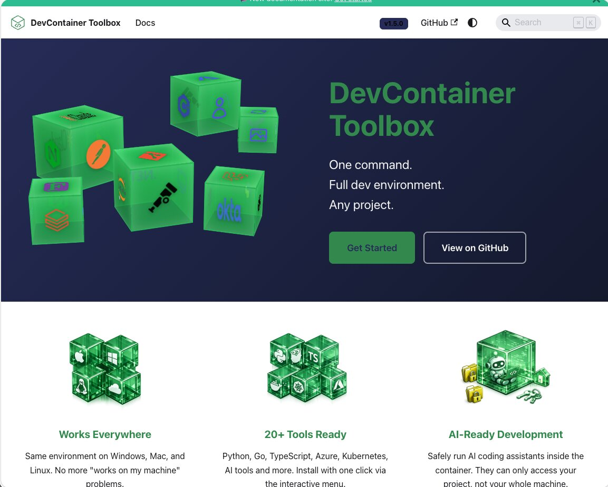
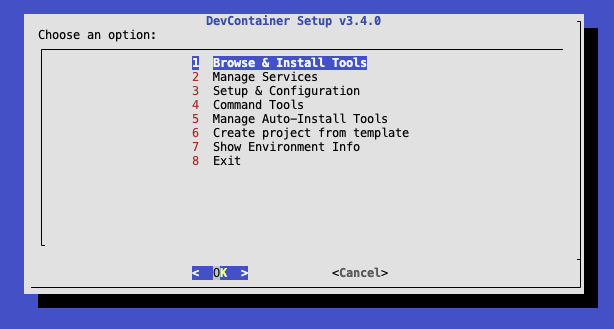

# DevContainer Toolbox

**One command. Full dev environment. Any project.**

Stop wasting time setting up development environments. DevContainer Toolbox gives you a complete, consistent setup that works on Windows, Mac, and Linux.

[](https://dct.sovereignsky.no/)

📚 **[View Full Documentation](https://dct.sovereignsky.no/)** | [Getting Started](https://dct.sovereignsky.no/docs/getting-started) | [Available Tools](https://dct.sovereignsky.no/docs/tools)

---

## Quick Start

**Prerequisites:** [Rancher Desktop](https://rancherdesktop.io/) (or [Docker Desktop](https://www.docker.com/products/docker-desktop)) must be installed and running.

**1. Install** (in your project folder):

```bash
# Mac/Linux
curl -fsSL https://raw.githubusercontent.com/terchris/devcontainer-toolbox/main/install.sh | bash

# Windows PowerShell
irm https://raw.githubusercontent.com/terchris/devcontainer-toolbox/main/install.ps1 | iex
```

This creates a single `devcontainer.json` and pulls the pre-built container image.

**2. Open in VS Code** and click **"Reopen in Container"** when prompted.

Done! The container starts in seconds. Run `dev-setup` to install tools.



---

## What You Get

<!-- TOOLS_START - Auto-generated by dev-docs, do not edit -->
**22+ development tools** ready to install with one click:

| Category | Tools |
|----------|-------|
| **Development Tools** | Bash, C/C++, C#, Fortran, Go, Java, PHP Laravel, Python, Rust, TypeScript |
| **AI & Machine Learning Tools** | Claude Code |
| **Cloud & Infrastructure Tools** | API, Azure Dev, Azure DevOps CLI, Azure Ops, Okta, Power Platform |
| **Data & Analytics Tools** | Data Analytics, Databricks |
| **Infrastructure & Configuration** | Dev Utilities, Terraform, Ansible, Kubernetes |

<!-- TOOLS_END -->

See [Available Tools](https://dct.sovereignsky.no/docs/tools) for details and installation guides.

---

## AI-Assisted Development

DevContainer Toolbox is built for AI coding assistants. The isolated container keeps the AI safely contained while giving it full access to your project.


This 30-second clip shows an AI adding a new development tool. [Learn how it works](https://dct.sovereignsky.no/docs/ai-docs/developing-using-ai).

---

## Prerequisites

- **Docker** - Install [Docker Desktop](https://www.docker.com/products/docker-desktop) or [Rancher Desktop](https://rancherdesktop.io/) (free, no license required)
- **VS Code** with [Dev Containers extension](https://marketplace.visualstudio.com/items?itemName=ms-vscode-remote.remote-containers)
- **Windows users** - Install WSL first: `wsl --install` (run as Administrator, then restart)

New to containers? See [What Are DevContainers?](https://dct.sovereignsky.no/docs/what-are-devcontainers)

---

## Documentation

- [Getting Started](https://dct.sovereignsky.no/docs/getting-started) - Installation and first steps
- [Available Tools](https://dct.sovereignsky.no/docs/tools) - All installable tools
- [Commands Reference](https://dct.sovereignsky.no/docs/commands) - All `dev-*` commands
- [AI Development](https://dct.sovereignsky.no/docs/ai-docs/developing-using-ai) - Working with AI coding assistants
- [Troubleshooting](https://dct.sovereignsky.no/docs/troubleshooting) - Common issues and solutions
- [Contributing](https://dct.sovereignsky.no/docs/contributors) - How to contribute

## License

MIT
