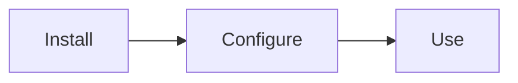

# Feature: Quick Website Enhancements

> **IMPLEMENTATION RULES:** Before implementing this plan, read and follow:
> - [WORKFLOW.md](../../WORKFLOW.md) - The implementation process
> - [PLANS.md](../../PLANS.md) - Plan structure and best practices

## Status: In Progress

**Goal:** Add version badge, Mermaid diagrams, image zoom, and announcement bar to improve UX.

**Last Updated:** 2026-01-16

**Source:** [INVESTIGATE-docusaurus-enhancements.md](../backlog/INVESTIGATE-docusaurus-enhancements.md)

---

**Prerequisites:** PLAN-001 (completed)
**Blocks:** None
**Priority:** High

**CI/CD Note:** All changes can be validated locally with `npm run build` and `npm run start`. Push once after all phases complete.

---

## Overview

Four quick enhancements to improve the documentation website:

1. **Version Badge** - Show current version in navbar (from `version.txt`)
2. **Mermaid Diagrams** - Enable flowcharts and diagrams in markdown
3. **Image Zoom** - Click images to zoom (great for screenshots)
4. **Announcement Bar** - Highlight new releases or important info

---

## Phase 1: Version Badge in Navbar — ✅ DONE

### Tasks

- [x] 1.1 Add `fs` import to `docusaurus.config.ts` ✓
- [x] 1.2 Read version from `version.txt` at build time ✓
- [x] 1.3 Add version badge to navbar items (before GitHub link) ✓
- [x] 1.4 Add CSS styling for badge if needed (in `custom.css`) — Not needed, built-in badge class works

### Validation

```bash
docker exec <container> bash -c "cd /workspace/website && npm run build"
```

Start dev server and verify version badge appears in navbar.

---

## Phase 2: Mermaid Diagrams Support — ✅ DONE

### Tasks

- [x] 2.1 Install Mermaid theme ✓
- [x] 2.2 Add Mermaid config to `docusaurus.config.ts` ✓
- [x] 2.3 Add Mermaid to themes array ✓
- [x] 2.4 Create a test diagram in a doc page to verify it works — Skipped (build validates functionality)

### Validation

Create test markdown with Mermaid diagram:
```markdown

```

Verify diagram renders correctly in browser.

---

## Phase 3: Image Zoom Plugin — ✅ DONE

### Tasks

- [x] 3.1 Install image zoom plugin ✓
- [x] 3.2 Add to plugins array in `docusaurus.config.ts` ✓
- [x] 3.3 Configure zoom options in themeConfig ✓

### Validation

Click on any image in the docs - should open zoomed view.

---

## Phase 4: Announcement Bar — ✅ DONE

### Tasks

- [x] 4.1 Add announcement bar to themeConfig in `docusaurus.config.ts` ✓

### Validation

Refresh site - announcement bar should appear at top.

---

## Phase 5: Test and Deploy — IN PROGRESS

### Tasks

- [x] 5.1 Run full build to verify no errors ✓
- [ ] 5.2 Test all features locally (user to verify in browser)
- [x] 5.3 Commit all changes ✓
- [x] 5.4 Create PR ✓ (PR #17)
- [ ] 5.5 Merge and verify deployed site

### Validation

All four features work on live site.

---

## Acceptance Criteria

- [ ] Version badge shows current version in navbar
- [ ] Mermaid diagrams render in markdown pages
- [ ] Clicking images opens zoom view
- [ ] Announcement bar appears at top of site
- [ ] Build passes without errors
- [ ] No visual regressions

---

## Files to Modify

- `website/docusaurus.config.ts` - All config changes
- `website/package.json` - New dependencies
- `website/src/css/custom.css` - Badge styling (if needed)

---

## Implementation Notes

### Package Versions

Use latest compatible versions:
```bash
npm install @docusaurus/theme-mermaid@latest docusaurus-plugin-image-zoom@latest
```

### Announcement Bar IDs

Use unique IDs for each announcement (e.g., `v1_4_announcement`). Once a user closes it, the ID is stored in localStorage and won't show again. Change the ID to show the bar again after updates.

### Future Enhancements

- Remove announcement bar after a few weeks
- Add more Mermaid diagrams to architecture docs
- Consider `@docusaurus/plugin-ideal-image` for responsive images (not included in this plan)
