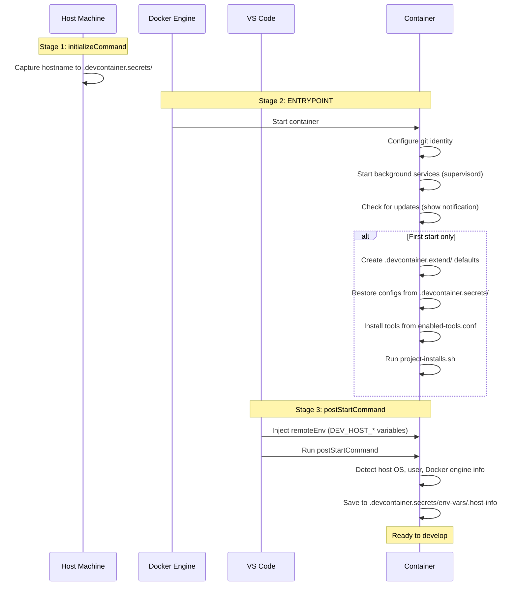

# Customizing Your Project

Configure your devcontainer to match your project's needs. These settings are stored in your project and shared with your team.

## File Locations

```
.devcontainer/
└── devcontainer.json          # Container config (references pre-built image)

.devcontainer.extend/          # Project config (commit to git)
├── enabled-tools.conf         # Tools to auto-install
├── enabled-services.conf      # Services to auto-start
└── project-installs.sh        # Custom setup script

.devcontainer.secrets/         # Secrets (git-ignored)
├── devcontainer-identity      # Git user name/email
└── ...                        # Other credentials
```

---

## devcontainer.json

The container configuration file. This is the only file you need in `.devcontainer/`.

**Location:** `.devcontainer/devcontainer.json`

It references the pre-built image on ghcr.io and contains settings for VS Code extensions, VPN capabilities, and environment variables. The container starts in seconds because everything is pre-built in the image.

Key settings:

| Setting | Purpose |
|---------|---------|
| `image` | Pre-built image reference (`ghcr.io/helpers-no/devcontainer-toolbox:latest`) |
| `overrideCommand` | Must be `false` so VS Code doesn't bypass the startup script |
| `runArgs` | VPN capabilities (NET_ADMIN, NET_RAW, etc.) |
| `customizations.vscode.extensions` | VS Code extensions to install |
| `remoteEnv` | Environment variables (`DCT_HOME`, `DCT_WORKSPACE`) |

You normally don't need to edit this file. The `install.sh` script creates it, and `dev-update` updates the image version when new releases are available.

---

## enabled-tools.conf

Tools listed here auto-install when the container is created or rebuilt.

**Location:** `.devcontainer.extend/enabled-tools.conf`

**Format:** One tool ID per line (matches `SCRIPT_ID` in install scripts)

```bash
# Example enabled-tools.conf
dev-golang
dev-python
tool-kubernetes
```

**How tools get added:**
- When you install a tool via `dev-setup`, it's automatically added
- You can also edit the file manually

**To see available tool IDs:**
```bash
dev-setup
# Select "Browse & Install Tools"
```

---

## enabled-services.conf

Services listed here auto-start when the container starts.

**Location:** `.devcontainer.extend/enabled-services.conf`

**Format:** One service ID per line

```bash
# Example enabled-services.conf
service-nginx
service-otel
```

**Managing services:**
```bash
dev-services status           # Show all services
dev-services enable nginx     # Enable auto-start
dev-services disable nginx    # Disable auto-start
```

---

## project-installs.sh

Your custom setup script that runs when the container is created.

**Location:** `.devcontainer.extend/project-installs.sh`

```bash
#!/bin/bash
set -e

printf "Running custom project installations...\n"

# Install npm dependencies
cd /workspace
npm install

# Install Python dependencies
pip install -r requirements.txt

# Run any other project setup
# ./scripts/setup-database.sh

printf "Custom project installations complete\n"
```

This is the right place for:
- Package manager installs (npm, pip, etc.)
- Database setup
- Code generation
- Any project-specific setup

---

## Secrets (.devcontainer.secrets/)

Credentials and sensitive config stored outside git.

**Location:** `.devcontainer.secrets/` (git-ignored)

Common files:
- `devcontainer-identity` - Git user name and email
- `nginx-config/` - Nginx backend configuration
- API keys and tokens

**Setting up secrets:**
```bash
dev-check    # Configure Git identity
dev-setup    # Other configurations via menu
```

Secrets survive container rebuilds because they're stored in the workspace, not the container.

---

## How It All Works Together

The container startup involves three stages that run in order. Each stage has access to different information:



**Why three stages?** The ENTRYPOINT runs before VS Code connects, so it cannot access host environment variables (`DEV_HOST_*`). Host detection runs in `postStartCommand` where VS Code has injected the variables. The `initializeCommand` runs on the host itself to capture data (like hostname) that isn't available via environment variables.

This happens automatically — open the project in VS Code and click "Reopen in Container".

See [devcontainer.json reference](contributors/architecture/devcontainer-json) for details on each field.
