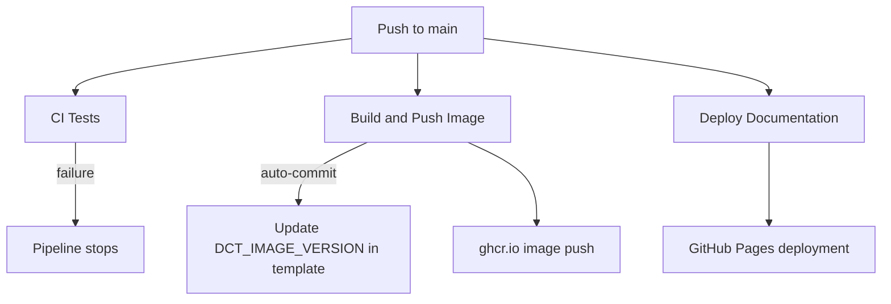
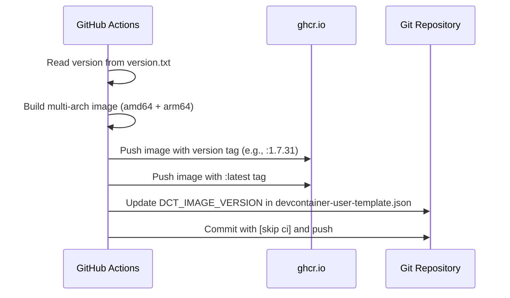
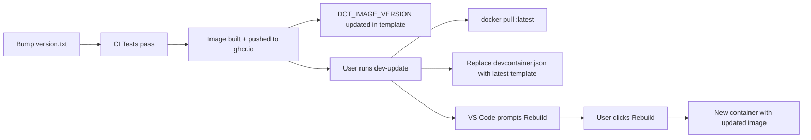

# CI/CD Pipeline

How code changes flow from commit to users. Three GitHub Actions workflows handle testing, image building, and documentation deployment.

---

## Pipeline Overview



---

## Workflow 1: CI Tests (`ci-tests.yml`)

**Triggers:** Push to `main` or PR when `.devcontainer/**`, `version.txt`, or the workflow itself changes.

**What it does:**

| Stage | Name | What it tests |
|-------|------|--------------|
| 0 | Documentation Update | Auto-runs `dev-docs` and commits generated files (main branch only) |
| 1 | Build Container | Builds test image from `Dockerfile.base` |
| 2 | Static Tests (Level 1) | Metadata, categories, flags, syntax — no execution |
| 3 | ShellCheck | Linting (warnings don't fail the build) |
| 4 | Unit Tests (Level 2) | `--help` execution, `--verify`, library functions |
| 5 | Test Summary | Reports results, fails if static or unit tests failed |

**Important:** Level 3 (install cycle) tests are NOT run in CI — they require a full devcontainer environment and download software. Contributors **must** run Level 3 locally after major changes (version bumps, install script modifications, new scripts). See [CREATING-SCRIPTS.md](../../ai-developer/CREATING-SCRIPTS#when-to-run-install-cycle-tests-level-3) for when and how to run them.

```bash
# Run inside the devcontainer after changing install scripts:
.devcontainer/additions/tests/run-all-tests.sh install install-dev-golang.sh

# Full cycle for ALL scripts (15-30 min):
.devcontainer/additions/tests/run-all-tests.sh install
```

**Known constraint:** The CI container runs as `vscode` but the workspace is mounted with the GitHub Actions runner user. Scripts that write to workspace files must handle "Permission denied" gracefully (see `ensure-gitignore.sh`).

---

## Workflow 2: Build and Push Container Image (`build-image.yml`)

**Triggers:** Push to `main` when `version.txt`, `image/**`, `.devcontainer/manage/**`, `.devcontainer/additions/**`, or the workflow itself changes.

**What it does:**



**Key details:**

- **Multi-arch:** Builds for both `linux/amd64` and `linux/arm64` using QEMU emulation
- **Two tags:** Every build pushes both a versioned tag (`:1.7.31`) and `:latest`
- **Auto-commit:** After the image is pushed, CI updates `DCT_IMAGE_VERSION` in `devcontainer-user-template.json` and commits with `[skip ci]` to prevent infinite loops
- **Cache:** Uses GitHub Actions cache (`type=gha`) to speed up rebuilds
- **Concurrency:** Only one image build runs at a time (`cancel-in-progress: true`)
- **Rebase before push:** The auto-commit step does `git pull --rebase` before pushing because other CI workflows may have pushed to main in the meantime

**Dockerfile:** `image/Dockerfile` (NOT `Dockerfile.base` — that's for CI tests only)

---

## Workflow 3: Deploy Documentation (`deploy-docs.yml`)

**Triggers:** Push to `main` when `website/**`, `version.txt`, or script/workflow files change.

**What it does:**

1. Builds the Docusaurus website (`npm run build`)
2. Deploys to GitHub Pages

**Output:** The DCT documentation website at `https://dct.sovereignsky.no`

---

## How Updates Reach Users



### For existing users

1. Maintainer bumps `version.txt` and pushes to main
2. CI builds and pushes new image to ghcr.io (tagged `:latest` + version)
3. CI auto-updates `DCT_IMAGE_VERSION` in the template
4. User sees startup notification: "Update available — run dev-update"
5. User runs `dev-update` → pulls image + replaces devcontainer.json + VS Code prompts Rebuild
6. User clicks Rebuild → new container with updated image + latest template

### For new users

1. User runs `install.sh` (downloads `devcontainer-user-template.json` from GitHub)
2. Template has `"image": "ghcr.io/.../devcontainer-toolbox:latest"` with current `DCT_IMAGE_VERSION`
3. User opens in VS Code → Reopen in Container → pulls `:latest` image
4. ENTRYPOINT initializes, `postStartCommand` detects host info
5. Ready to develop

---

## Auto-Generated Files

Several files are committed by CI bots. These should NOT be edited manually:

| File | Generated by | When |
|------|-------------|------|
| `devcontainer-user-template.json` (`DCT_IMAGE_VERSION` field) | `build-image.yml` | After each image build |
| `website/docs/tools/index.mdx` | `ci-tests.yml` (docs-update job) | On push to main |
| `website/docs/commands.md` | `ci-tests.yml` (docs-update job) | On push to main |
| `README.md` | `ci-tests.yml` (docs-update job) | On push to main |
| `website/src/data/tools.json` | `ci-tests.yml` (docs-update job) | On push to main |
| `website/src/data/categories.json` | `ci-tests.yml` (docs-update job) | On push to main |

---

## Workflow Files

| File | Purpose |
|------|---------|
| `.github/workflows/ci-tests.yml` | Test runner (static + unit) + auto-docs |
| `.github/workflows/build-image.yml` | Multi-arch image build + push + template version update |
| `.github/workflows/deploy-docs.yml` | Docusaurus build + GitHub Pages deployment |

---

## Race Conditions

Multiple workflows push to main concurrently (`ci-tests.yml` auto-docs, `build-image.yml` template update). This causes "rejected — fetch first" errors.

**Mitigation:** All auto-commit steps use `git pull --rebase` before `git push`. The `[skip ci]` tag prevents infinite CI loops from bot commits.
