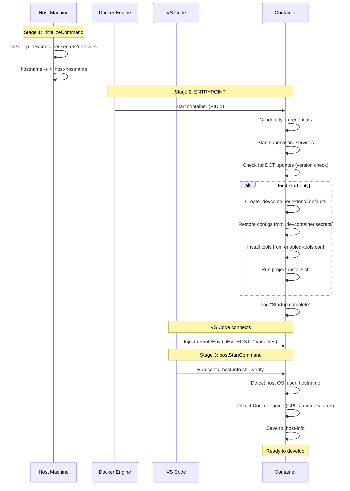
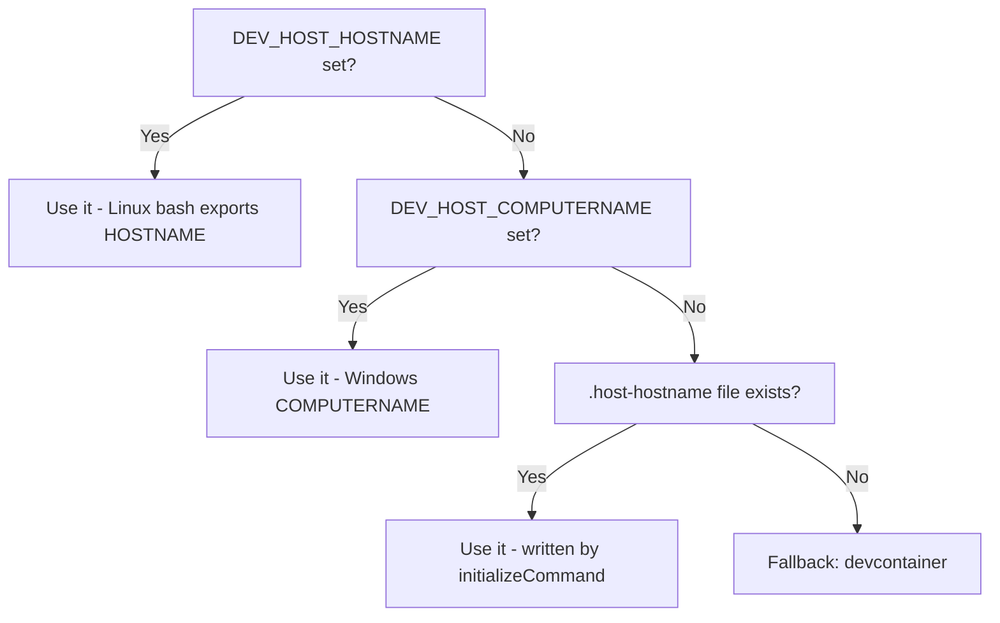

# Container Startup Lifecycle

How DCT initializes a devcontainer from first start to ready-to-develop, and why the startup is split across three stages.

---

## The Three Stages



---

## Stage 1: initializeCommand (runs on host)

**File:** Defined in `devcontainer.json`

```json
"initializeCommand": "mkdir -p .devcontainer.secrets/env-vars && hostname -s > .devcontainer.secrets/env-vars/.host-hostname 2>/dev/null || hostname > .devcontainer.secrets/env-vars/.host-hostname 2>/dev/null || true"
```

Runs on the **host machine** before the container starts. This is the only stage that executes outside the container.

**Purpose:** Capture the host's real hostname. This is needed because:
- macOS (zsh) doesn't export `HOSTNAME` as an environment variable
- `remoteEnv` can only pass variables that exist — if `HOSTNAME` is empty, `DEV_HOST_HOSTNAME` is empty
- `hostname -s` works on Mac, Linux, and Windows (WSL2)

**Output:** `.devcontainer.secrets/env-vars/.host-hostname` containing the short hostname (e.g., `MBP-J4G0G066W2`).

**Cross-platform behavior:**

| Platform | `hostname -s` returns |
|----------|----------------------|
| macOS | Machine name (e.g., `MBP-J4G0G066W2`) |
| Linux | Machine hostname (e.g., `terje-desktop`) |
| Windows (WSL2) | WSL hostname |
| Windows (PowerShell) | Falls back to `hostname` without `-s` |

---

## Stage 2: ENTRYPOINT (runs in container, no remoteEnv)

**File:** `image/entrypoint.sh`

The ENTRYPOINT is a Docker-level construct. It runs as PID 1 before any IDE connects. **`remoteEnv` variables are NOT available** at this stage — VS Code hasn't connected yet.

### Every start

| Step | What it does | File |
|------|-------------|------|
| Git config | Set safe directory, file mode, hidden files | entrypoint.sh |
| Gitignore | Ensure `.devcontainer.secrets/` is gitignored | `lib/ensure-gitignore.sh` |
| VS Code extensions | Ensure Dev Containers extension is recommended | `lib/ensure-vscode-extensions.sh` |
| Credentials | Symlink Claude Code + GitHub CLI credentials | `lib/claude-credential-sync.sh`, `lib/gh-credential-sync.sh` |
| Git identity | Apply host-captured git name/email | entrypoint.sh |
| Services | Start supervisord, OTel monitoring if enabled | entrypoint.sh |
| Version check | Check if newer DCT image available (5s timeout) | entrypoint.sh |

### First start only (inside `INIT_MARKER` check)

| Step | What it does |
|------|-------------|
| Create `.devcontainer.extend/` | Generate `enabled-tools.conf`, `enabled-services.conf`, `project-installs.sh` with templates |
| Restore configs | Run `--verify` on all config scripts (git, Azure DevOps, etc.) — **except** `config-host-info.sh` which needs remoteEnv |
| Install tools | Read `enabled-tools.conf`, run install scripts for each enabled tool |
| Project installs | Run `.devcontainer.extend/project-installs.sh` for custom setup |

### Output

All ENTRYPOINT output is redirected to `/tmp/.dct-startup.log`. The welcome script (`dev-welcome.sh`) streams this to the user's first terminal.

---

## Stage 3: postStartCommand (runs in container, remoteEnv available)

**File:** Defined in `devcontainer.json`, calls `config-host-info.sh`

```json
"postStartCommand": "bash /opt/devcontainer-toolbox/additions/config-host-info.sh --verify 2>/dev/null || true"
```

Runs after VS Code connects and injects `remoteEnv`. This is the first point where `DEV_HOST_*` variables are available.

**Purpose:** Detect the host platform and save the results to `.host-info`.

---

## Host Info Detection (`config-host-info.sh`)

### Hostname resolution chain

`config-host-info.sh` resolves the host's hostname using a 4-step fallback:



| Source | Works on | How it gets there |
|--------|----------|------------------|
| `DEV_HOST_HOSTNAME` | Linux | `${localEnv:HOSTNAME}` in remoteEnv — bash exports it |
| `DEV_HOST_COMPUTERNAME` | Windows | `${localEnv:COMPUTERNAME}` in remoteEnv |
| `.host-hostname` file | Mac, Linux, Windows | `initializeCommand` runs `hostname -s` on host |
| Fallback `devcontainer` | All | When nothing else is available |

### Platform detection logic

```bash
if [ "${DEV_HOST_OS}" = "Windows_NT" ]; then
    HOST_OS="Windows"
elif [[ "${DEV_HOST_HOME}" == /Users/* ]]; then
    HOST_OS="macOS"
elif [ -n "${DEV_HOST_USER}" ]; then
    HOST_OS="Linux"
else
    HOST_OS="unknown"
fi
```

### Docker engine detection

`config-host-info.sh` also captures Docker host info via `docker info`:

| Field | Example | What it reveals |
|-------|---------|----------------|
| `DOCKER_CONTAINER_NAME` | `musing_sanderson` | VS Code's container name |
| `DOCKER_HOST_NAME` | `lima-rancher-desktop` | Docker runtime (Rancher Desktop, Docker Desktop, OrbStack) |
| `DOCKER_HOST_CPUS` | `8` | Host CPU count |
| `DOCKER_HOST_MEMORY` | `15.6GiB` | Host RAM available to Docker |
| `DOCKER_HOST_ARCH` | `aarch64` | Host CPU architecture |
| `DOCKER_HOST_OS` | `Alpine Linux v3.23` | Docker VM's OS |

### Output: `.host-info`

All detected values are saved to `.devcontainer.secrets/env-vars/.host-info`:

```bash
export HOST_OS="macOS"
export HOST_USER="terje.christensen"
export HOST_HOSTNAME="MBP-J4G0G066W2"
export HOST_DOMAIN="none"
export HOST_CPU_ARCH="arm64"
export DOCKER_CONTAINER_NAME="musing_sanderson"
export DOCKER_HOST_NAME="lima-rancher-desktop"
export DOCKER_HOST_CPUS="8"
export DOCKER_HOST_MEMORY="15.6GiB"
export DOCKER_HOST_ARCH="aarch64"
export DOCKER_HOST_OS="Alpine Linux v3.23"
```

This file is:
- Sourced by OTel configs for telemetry resource attributes
- Read by `dev-env` to display host information
- Persists across container restarts (workspace mount)
- Overwritten on every container start by `postStartCommand`

### Commands

| Command | What it does |
|---------|-------------|
| `config-host-info --env` | Show all `DEV_HOST_*` environment variables |
| `config-host-info --refresh` | Re-detect and show results |
| `config-host-info --verify` | Silent re-detect and save (used by postStartCommand) |
| `config-host-info --show` | Display saved `.host-info` contents |

---

## Why Three Stages?

The split exists because of a fundamental constraint: **`remoteEnv` is injected by VS Code after the container starts, not before.**

| Stage | Runs | remoteEnv available | Can write to workspace |
|-------|------|--------------------|-----------------------|
| `initializeCommand` | On host | N/A (host env) | Yes (host filesystem) |
| ENTRYPOINT | In container | No | Yes |
| `postStartCommand` | In container | Yes | Yes |

If VS Code injected `remoteEnv` before the ENTRYPOINT, all of this could be a single stage. But the devcontainer spec doesn't work that way — the ENTRYPOINT is a Docker concept, and VS Code layers its features on top after the container is running.

---

## Known Issue: Permission Handling in CI

In CI (`ci-tests.yml`), the workspace is mounted with the GitHub Actions runner user, but the container runs as `vscode`. This causes "Permission denied" when scripts try to write to workspace files (like `.gitignore`).

`ensure-gitignore.sh` handles this by wrapping all writes with `2>/dev/null || true`. Any script that writes to workspace files during startup should follow the same pattern to avoid breaking CI tests.

---

## File Reference

| File | Purpose |
|------|---------|
| `image/entrypoint.sh` | Main startup script (ENTRYPOINT) |
| `.devcontainer/additions/config-host-info.sh` | Host detection + Docker engine info |
| `.devcontainer/additions/lib/ensure-gitignore.sh` | Gitignore management (sourced by logging.sh) |
| `.devcontainer/additions/lib/ensure-vscode-extensions.sh` | VS Code extension recommendations |
| `.devcontainer/manage/dev-welcome.sh` | Welcome message + startup log display |
| `.devcontainer.secrets/env-vars/.host-info` | Saved host detection results |
| `.devcontainer.secrets/env-vars/.host-hostname` | Host hostname (from initializeCommand) |
| `/tmp/.dct-startup.log` | Startup log (streamed to first terminal) |
| `/tmp/.dct-initialized` | Init marker (prevents re-running first-start block) |
